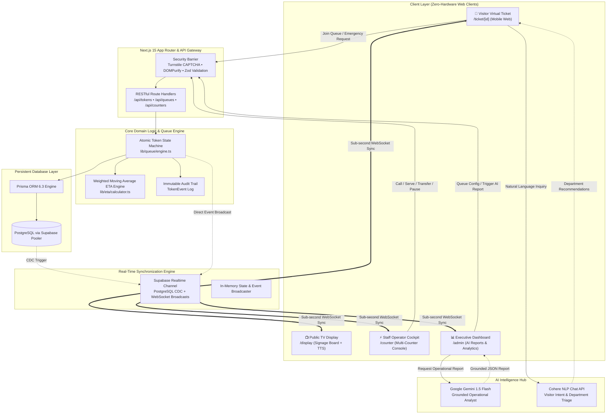
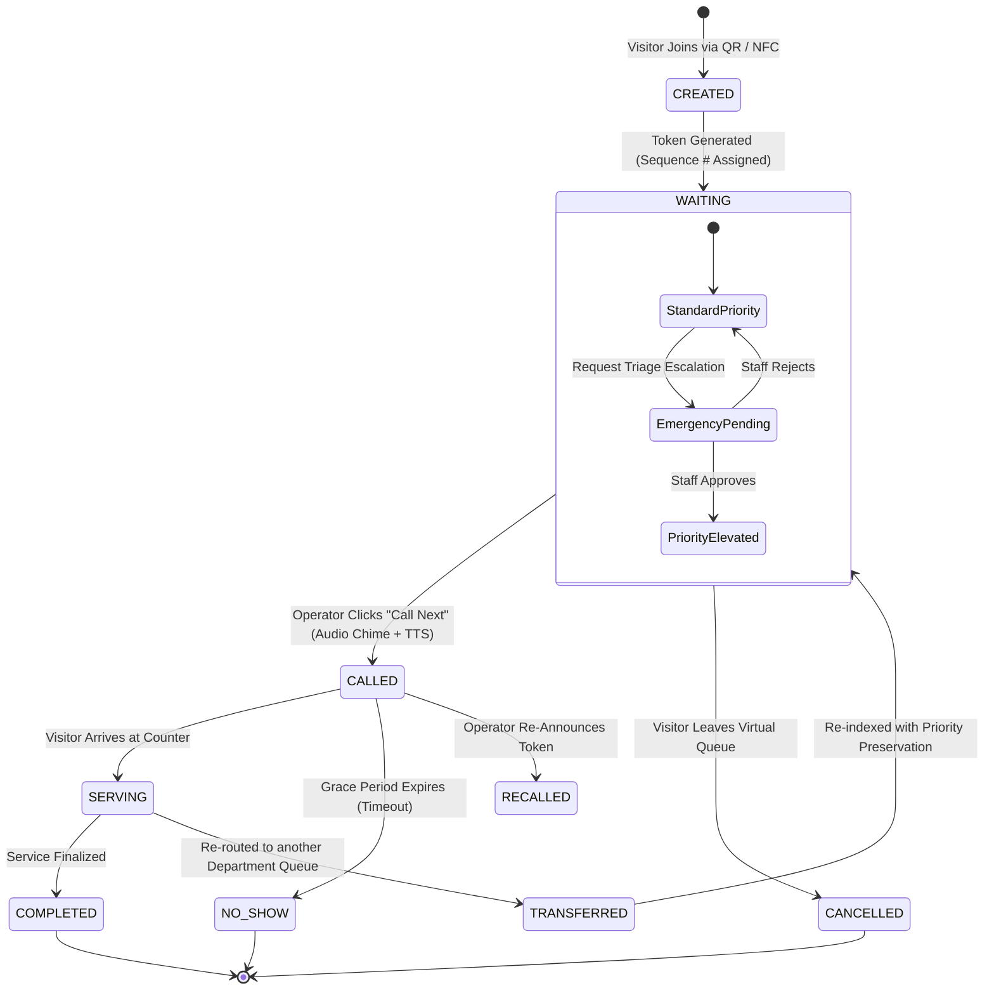
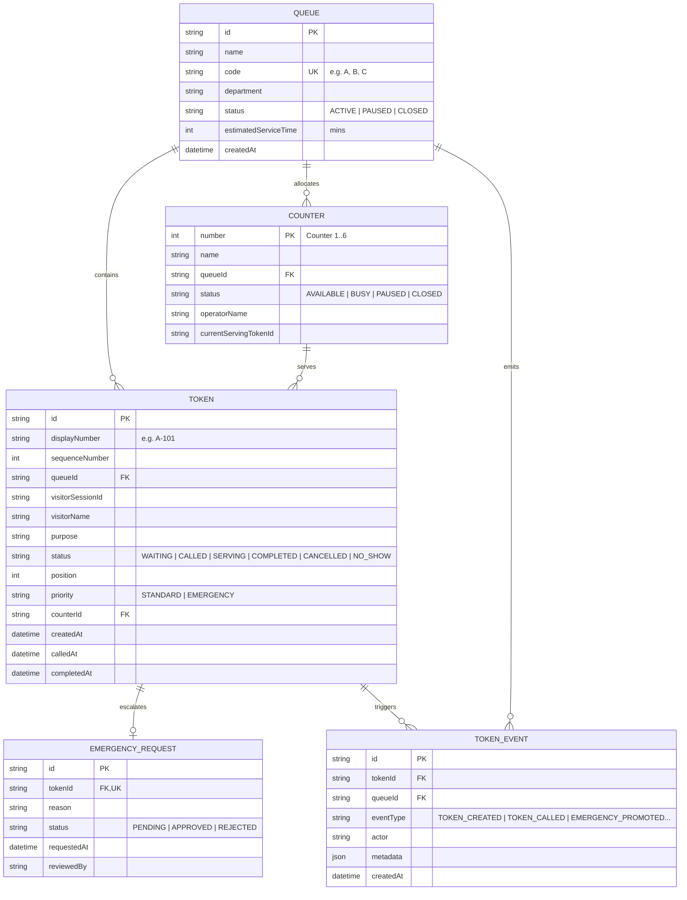

<div align="center">

```
  ██╗     ██╗██╗   ██╗███████╗ ██████╗ ██╗   ██╗███████╗██╗   ██╗███████╗
  ██║     ██║██║   ██║██╔════╝██╔═══██╗██║   ██║██╔════╝██║   ██║██╔════╝
  ██║     ██║██║   ██║█████╗  ██║   ██║██║   ██║█████╗  ██║   ██║█████╗  
  ██║     ██║╚██╗ ██╔╝██╔══╝  ██║▄▄ ██║██║   ██║██╔══╝  ██║   ██║██╔══╝  
  ███████╗██║ ╚████╔╝ ███████╗╚██████╔╝╚██████╔╝███████╗╚██████╔╝███████╗
  ╚══════╝╚═╝  ╚═══╝  ╚══════╝ ╚══▀▀═╝  ╚═════╝ ╚══════╝ ╚═════╝ ╚══════╝
```

### ⚡ Next-Generation AI Real-Time Institutional Queue & Crowd Orchestration Platform ⚡

[](https://github.com/)
[](https://nextjs.org/)
[](https://react.dev/)
[](https://www.typescriptlang.org/)
[](https://tailwindcss.com/)
[](https://www.prisma.io/)
[](https://supabase.com/)
[](https://ai.google.dev/)
[](https://cohere.com/)

<br />

<p align="center">
  <b>Eliminating physical lobby congestion, paper token friction, and erratic counter delays through sub-second WebSocket state synchronization, AI triage routing, dynamic weighted ETA prediction, and voice-assisted digital signage.</b>
</p>

---

### 🏆 Vibecode Hackathon Submission

**Developed with ❤️ and pure passion by:**

| 👨‍💻 Team Member | 🎯 Role & Focus |
| :--- | :--- |
| **Rehan Ansari** | Full-Stack Architecture, Real-Time Engine, Next.js 15 & Supabase Pipeline |
| **Patel Afifa** | AI Intelligence Layer, Gemini Operational Reports & Cohere Intent Triage |
| **Poonawala Mansoor** | UI/UX & Interactive Design, GSAP Crowd Canvas, Audio Signage & Telemetry |

</div>

<br />

---

## 📑 Table of Contents

- [🌌 Problem Statement & Vision](#-problem-statement--vision)
- [✨ Core Capabilities & Feature Matrix](#-core-capabilities--feature-matrix)
- [📐 System Architecture & Data Flow](#-system-architecture--data-flow)
- [🧠 AI & Intelligence Architecture](#-ai--intelligence-architecture)
- [🔄 Detailed Queue & Token Lifecycle Workflow](#-detailed-queue--token-lifecycle-workflow)
- [🛠️ Technology Stack](#️-technology-stack)
- [🗄️ Database Schema & Data Models](#️-database-schema--data-models)
- [📱 Module Breakdown](#-module-breakdown)
  - [1. Visitor Virtual Pass & Mobile Ticket](#1-visitor-virtual-pass--mobile-ticket)
  - [2. Staff Operator Cockpit](#2-staff-operator-cockpit)
  - [3. Airport-Grade Public Signage Display](#3-airport-grade-public-signage-display)
  - [4. AI Command Center & Analytics](#4-ai-command-center--analytics)
- [🔒 Security, Resilience & Data Integrity](#-security-resilience--data-integrity)
- [🚀 Quick Start & Installation Guide](#-quick-start--installation-guide)
- [📂 Project Directory Structure](#-project-directory-structure)
- [🔮 Future Roadmap](#-future-roadmap)
- [📜 License & Acknowledgments](#-license--acknowledgments)

---

## 🌌 Problem Statement & Vision

Physical institutions — such as **hospitals, universities, banks, diagnostic centers, and civic administration bureaus** — suffer from pervasive crowd bottlenecks:
1. **Lobby Congestion & Uncontrolled Footfall**: Disorganized queues cause anxiety, safety risks, and wasted hours for visitors waiting in cramped hallways.
2. **Static & Opaque Wait Times**: Paper tokens or static LED boards give zero visibility into real wait times or delay reasons.
3. **Emergency Triage Blindspots**: Visitors with acute medical or urgent requirements are stranded behind non-urgent administrative queries.
4. **Staff Imbalance & Siloed Counters**: Counter operators lack real-time visibility into incoming load across departments.

### 💡 The LiveQueue Solution
**LiveQueue** transforms physical waiting into an **asynchronous, intelligent, and zero-hardware experience**. Visitors scan a dynamic QR code on arrival, receive an interactive live pass on their mobile browser with real-time positional updates, while institutional staff operate an intelligent cockpit backed by AI-driven triage and operational predictive analytics.

---

## ✨ Core Capabilities & Feature Matrix

```
┌──────────────────────────────────────────────────────────────────────────────────────────────────┐
│                                    LIVEQUEUE FEATURE MATRIX                                      │
├──────────────────────────┬─────────────────────────────┬─────────────────────────────────────────┤
│ Module                   │ Key Capability              │ Technology / Implementation            │
├──────────────────────────┼─────────────────────────────┼─────────────────────────────────────────┤
│ 📱 Zero-Install Ticket   │ Live Animated Counter       │ @number-flow/react + GSAP Transitions   │
│                          │ Dynamic Weighted ETA        │ Historical Avg + Counter Throughput     │
│                          │ Triage Escalation Request   │ Atomic DB Priority Mutation             │
│                          │ Offline / Reconnect Sync    │ Persistent Local Storage + SWR Polling  │
├──────────────────────────┼─────────────────────────────┼─────────────────────────────────────────┤
│ 🖥️ Staff Cockpit         │ Atomic Token State Machine  │ Prisma Transaction Isolation            │
│                          │ Live Queue Audio Chimes     │ Web Audio Synthesis                     │
│                          │ Emergency Priority Approval │ One-Click In-Line Triage Resolution     │
│                          │ Transfer / Pause Workflows  │ Multi-department Re-routing Engine      │
├──────────────────────────┼─────────────────────────────┼─────────────────────────────────────────┤
│ 🎙️ Digital Signage       │ Multi-Lingual Text-To-Speech│ Web Speech Synthesis API (Natural Tone) │
│                          │ Split-Screen Layout         │ High-contrast Airport & Hospital UX     │
│                          │ Real-Time WebSocket Updates │ Supabase Realtime Broadcast & Postgres  │
├──────────────────────────┼─────────────────────────────┼─────────────────────────────────────────┤
│ 🧠 AI Intelligence Layer │ Cohere Natural Language NLP │ Intent Matching & Smart Queue Routing   │
│                          │ Gemini 1.5 Flash Analytics  │ Grounded Executive Operational Reports  │
│                          │ Anomaly & Starvation Alerts │ Real-time KPI Heuristics                │
└──────────────────────────┴─────────────────────────────┴─────────────────────────────────────────┘
```

---

## 📐 System Architecture & Data Flow

LiveQueue is designed with **event-driven architecture**, **strict ACID database boundaries**, and **sub-second real-time broadcast pipelines**.



---

## 🧠 AI & Intelligence Architecture

### 1. 🤖 Google Gemini 1.5 Flash — Operational Intelligence & Congestion Diagnosis
LiveQueue feeds sanitized, live operational telemetry (`waitingCount`, `averageWaitMins`, `activeCountersCount`, `noShowRatio`, `emergencyVolume`) directly into Gemini 1.5 Flash to generate grounded executive reports:
- **Executive Summary**: Real-time synopsis of institutional throughput.
- **Congestion Analysis**: Bottleneck detection across department queues.
- **Counter Efficiency**: Active vs. idle worker analysis and service cadence.
- **Smart Recommendations**: Automated tactical interventions (e.g., reassigning staff to peak-load queues).

```typescript
// Sample Gemini Grounded Input Contract
const operationalReport = await generateOperationalReport({
  totalTokensToday: 142,
  waitingCount: 18,
  completedCount: 118,
  noShowCount: 6,
  averageWaitMins: 12.4,
  averageServiceMins: 4.8,
  activeCountersCount: 4,
  pausedCountersCount: 1,
  emergencyRequestsCount: 2,
  queueBreakdown: [...]
});
```

### 2. 💬 Cohere NLP — Semantic Intent Triage & Department Matching
When visitors enter natural language descriptions of their issue (e.g., *"I need an urgent duplicate grade sheet for visa verification"*), Cohere parses intent and calculates similarity scores against active department profiles to guide visitors to the exact queue code (`A`, `B`, `C`, etc.).

---

## 🔄 Detailed Queue & Token Lifecycle Workflow



---

## 🛠️ Technology Stack

### 🎨 Frontend & Interface Engineering
- **Next.js 15 (App Router)** — React Server Components, Streaming SSR, and optimized Edge routing.
- **React 19** — Concurrent rendering, transitions, and modern hook paradigms.
- **TypeScript** — Strict end-to-end type safety.
- **Tailwind CSS 3.4** — Custom dark cybernetic design tokens, glow utilities, and glassmorphism.
- **GSAP 3.15 + ScrollTrigger** — High-performance interactive crowd simulations and narrative landing page.
- **Framer Motion 12** — Micro-interactions, spring layouts, and smooth ticket transitions.
- **NumberFlow React** — Smooth mechanical odometer transitions for queue position digits.
- **Lucide Icons** — Lightweight vector iconography.

### ⚙️ Backend, Database & Infrastructure
- **Prisma ORM 6.3** — Type-safe query building, migration management, and relation modeling.
- **PostgreSQL (Supabase)** — High-performance transactional persistence with connection pooling.
- **Supabase Realtime** — WebSocket channels for instantaneous cross-client state synchronization.
- **Web Speech API** — Native browser-driven Text-to-Speech audio synthesizer for public broadcast boards.
- **Zod 3.24** — Schema validation and runtime input sanitization.
- **DOMPurify** — XSS neutralization across all visitor inputs.

### 🧠 Artificial Intelligence & Machine Learning
- **Google Generative AI (`@google/generative-ai`)** — Gemini 1.5 Flash for operational assessment and strategic forecasting.
- **Cohere API** — Transformer-based semantic intent routing.

---

## 🗄️ Database Schema & Data Models

The relational schema is engineered in PostgreSQL with index optimization on `[queueId, status, position]` for constant-time sub-second queries.



---

## 📱 Module Breakdown

### 1. Visitor Virtual Pass & Mobile Ticket (`/ticket/[id]`)
- **Zero App Download**: Instant web access via dynamic QR code.
- **Real-Time Dynamic Position**: Live animated position counter with remaining tokens ahead.
- **Dynamic ETA Countdown**: Continuous weighted recalculation as counters process visitors.
- **Urgent Triage Request**: Direct portal to request priority review with automated admin notification.
- **Status Change Vibrations & Alerts**: Haptic visual indicators when token state turns to `CALLED`.

### 2. Staff Operator Cockpit (`/counter`)
- **Multi-Counter Selector**: Counter 1 through 6 with individual operator assignments.
- **Action Control Bar**: Instant one-click triggers:
  - `🔔 Call Next Token`
  - `▶️ Start Serving`
  - `✅ Complete Service`
  - `🚫 Mark No-Show`
  - `🔁 Recall Token`
  - `🔀 Transfer Queue`
  - `☕ Take Break / Pause Counter`
- **Emergency Action Center**: Live notifications for incoming triage requests with instantaneous atomic re-indexing upon approval.

### 3. Airport-Grade Public Signage Display (`/display`)
- **Ultra-High Contrast Visual Design**: Optimized for 4K and 1080p wall displays with zero visual clutter.
- **Voice Text-to-Speech Engine**: Speaks clear announcements (*"Token A-104, please proceed to Counter 2"*).
- **Now Serving vs. Upcoming Grid**: High visibility layout showing active counters and queued tokens.
- **Real-Time Status Bar**: Institutional updates, operational notices, and live timekeeper.

### 4. AI Command Center & Analytics (`/admin`)
- **Key Performance Indicators**:
  - Live Active Visitors vs. Historical Daily Throughput.
  - Average Wait Time (calculated dynamically from real events).
  - No-show and drop-off rate tracking.
- **Gemini Operational Briefing**: Click to generate on-demand AI executive summaries with bottleneck warnings.
- **Queue & Department Management**: Pause, resume, create, and calibrate service duration for queues.
- **Live Event Audit Stream**: Immutable JSON-backed event history for transparency and compliance.

---

## 🔒 Security, Resilience & Data Integrity

- 🛡️ **Cloudflare Turnstile CAPTCHA**: Prevents bot-driven queue flooding and denial-of-service token generation.
- 🧹 **Input Sanitization with DOMPurify**: Strips harmful scripts and payload injection from visitor purpose inputs.
- ⚡ **Atomic Database Transactions**: All token position shifts and counter transitions execute inside isolated Prisma transactions to eliminate race conditions.
- 🔄 **Graceful Degradation & Heuristic Fallback**: AI services include automatic local heuristic fallbacks in the event of API rate-limits or network interruptions.
- 📦 **Session Isolation**: Visitor session IDs stored in local state prevent cross-session manipulation.

---

## 🚀 Quick Start & Installation Guide

### Prerequisites
- **Node.js**: v18.18.0 or higher
- **npm** / **yarn** / **pnpm**
- **PostgreSQL Database** (Supabase recommended)

### 1. Clone the Repository
```bash
git clone https://github.com/rehan-1002/VCH.git
cd VCH
```

### 2. Install Dependencies
```bash
npm install
```

### 3. Configure Environment Variables
Create a `.env` file in the project root:
```env
# Database Connections (PostgreSQL / Supabase)
DATABASE_URL="postgresql://postgres:[PASSWORD]@[HOST]:6543/postgres?pgbouncer=true"
DIRECT_URL="postgresql://postgres:[PASSWORD]@[HOST]:5432/postgres"

# Supabase Realtime & Public Access
NEXT_PUBLIC_SUPABASE_URL="https://[YOUR_PROJECT].supabase.co"
NEXT_PUBLIC_SUPABASE_ANON_KEY="[YOUR_SUPABASE_ANON_KEY]"

# AI API Keys
GEMINI_API_KEY="[YOUR_GOOGLE_GEMINI_API_KEY]"
COHERE_API_KEY="[YOUR_COHERE_API_KEY]"

# Cloudflare Turnstile (Optional / Bot Protection)
NEXT_PUBLIC_TURNSTILE_SITE_KEY=""
TURNSTILE_SECRET_KEY=""
```

### 4. Initialize Database & Seed
```bash
# Push Prisma schema to PostgreSQL
npm run db:push

# Generate Prisma client
npm run db:generate
```

### 5. Run Development Server
```bash
npm run dev
```
Open [http://localhost:3000](http://localhost:3000) in your browser to experience LiveQueue!

---

## 📂 Project Directory Structure

```
├── app/
│   ├── admin/               # Executive Analytics & AI Intelligence Command Center
│   ├── api/                 # Next.js Route Handlers (RESTful API)
│   │   ├── ai/              # Gemini & Cohere Endpoints
│   │   ├── analytics/       # Aggregated KPIs & Audit Events
│   │   ├── counters/        # Counter Status & Assignment Operations
│   │   ├── emergency/       # Triage Request & Approval Handlers
│   │   ├── queues/          # Queue Management & Department Config
│   │   ├── realtime/        # Webhook / SSE Fallback Handlers
│   │   └── tokens/          # Token State Transitions (Call, Serve, Complete)
│   ├── counter/             # Staff Operator Interactive Cockpit
│   ├── display/             # TV Signage Screen with Voice Synthesizer (TTS)
│   ├── join/                # Visitor Check-in & QR Code Reader
│   ├── ticket/[id]/         # Live Mobile Virtual Pass with Dynamic Position
│   ├── globals.css          # Cybernetic Dark Mode Design Tokens
│   ├── layout.tsx           # Global Shell & Navigation
│   └── page.tsx             # Narrative Landing Page with Skiper39 Crowd Canvas
├── components/
│   ├── hooks/               # Custom React Hooks (Audio, Realtime, Speech)
│   ├── queue/               # Queue Cards, Counters & Live Indicators
│   ├── ui/                  # Accessible Reusable Component Primitives
│   └── visitor/             # Visitor Mobile UI & Emergency Modal
├── lib/
│   ├── ai/                  # Gemini & Cohere Integration Engines
│   ├── analytics/           # KPI & Statistical Calculation Logic
│   ├── db/                  # Prisma Database Client Singleton
│   ├── eta/                 # Weighted Moving Average Waiting Engine
│   ├── queue/               # Atomic State Engine & Mutation Handlers
│   ├── realtime/            # Supabase Realtime Channels
│   └── security/            # Cloudflare Turnstile & Sanitization
├── prisma/
│   └── schema.prisma        # Database Relational Data Model
├── public/
│   ├── audio/               # Notification Chimes & Alert Tones
│   └── images/              # Assets & Crowd Canvas Sprites
└── tailwind.config.ts       # Design System Configuration
```

---

## 🔮 Future Roadmap

- [ ] **Multi-Facility Geo-Fencing**: Automatic queue check-in triggered when a visitor enters a 100m geofence radius.
- [ ] **WhatsApp & SMS Gateway**: Zero-data SMS status updates for non-smartphone visitors.
- [ ] **Predictive Staff Scheduling**: Deep learning models to predict tomorrow's peak congestion and automatically suggest optimal counter shifts.
- [ ] **Wearable Operator App**: Smartwatch notifications for counter operators when high-priority emergencies are escalated.

---

## 📜 License & Acknowledgments

This project is open-source under the **MIT License**.

Built with pride for the **Vibecode Hackathon** by **Rehan Ansari**, **Patel Afifa**, and **Poonawala Mansoor**.

<div align="center">
  <sub>Engineered for speed, built for real-world impact.</sub><br />
  <b>⚡ LiveQueue // Intelligent Crowd Management Engine ⚡</b>
</div>
